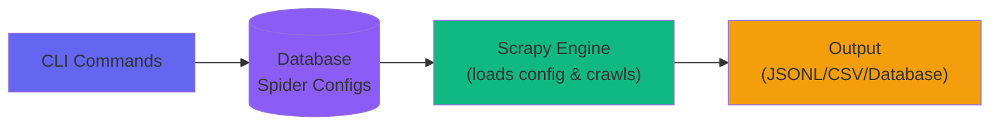
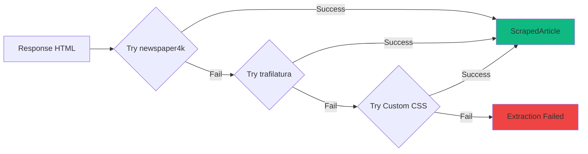

ScrapAI is an orchestration layer on top of Scrapy. Instead of writing Python spider files, an AI agent generates JSON configs stored in a database. A single generic spider loads any config at runtime.

## High-Level Architecture



**Simple flow:** CLI stores spider configs in database → Scrapy loads config and crawls → Data exported to files or database

## Component Breakdown

### Entry Point: `scrapai` Script

```bash scrapai Script
#!/usr/bin/env bash
# Auto-activates virtualenv, delegates to CLI
./scrapai crawl bbc_co_uk --project news
```

The `scrapai` entry point:
- Auto-activates the virtual environment (no manual `source venv/bin/activate`)
- Delegates commands to the Click-based CLI
- Handles environment setup and validation

### CLI Layer (`cli/`)

Built with [Click](https://click.palletsprojects.com/), the CLI provides commands for:

<CardGroup cols={2}>
  <Card title="Spider Management" icon="spider">
    `spiders list`, `spiders import`, `spiders delete`
  </Card>
  
  <Card title="Crawling" icon="arrows-spin">
    `crawl <spider>` with test mode (`--limit`) and production mode
  </Card>
  
  <Card title="Data Access" icon="table">
    `show <spider>`, `export <spider>` (CSV/JSON/JSONL/Parquet)
  </Card>
  
  <Card title="Queue Management" icon="list-check">
    `queue add`, `queue bulk`, `queue list`, `queue next`
  </Card>
</CardGroup>

```python CLI Structure
cli/
├── __init__.py        # Main CLI entry point
├── spiders.py         # Spider CRUD commands
├── crawl.py           # Crawl execution
├── data.py            # Show and export commands
├── queue.py           # Batch processing queue
└── inspect.py         # URL inspection tool
```

### Database Layer (`core/models.py`, `core/db.py`)

ScrapAI uses SQLAlchemy with support for both SQLite (default) and PostgreSQL (production).

#### Core Models

<CardGroup cols={2}>
  <Card title="Spider" icon="spider">
    Stores spider configuration: name, domains, start URLs, project, callbacks
  </Card>
  <Card title="SpiderRule" icon="route">
    URL patterns (allow/deny), callback mapping, follow behavior
  </Card>
  <Card title="SpiderSetting" icon="gear">
    Spider-specific settings (delays, concurrency, extractors)
  </Card>
  <Card title="ScrapedItem" icon="file-lines">
    Scraped data: URL, title, content, author, date, metadata
  </Card>
</CardGroup>

**Key Point**: Spiders are rows, not files. Adding a website means inserting a row.

<Info>
  **SQLite (default)** for development and small-scale production. **PostgreSQL** for multi-user access or high concurrency. Configure via `DATABASE_URL` in `.env`.
</Info>

### Spider Layer (`spiders/database_spider.py`)

**One spider class for all websites.** `DatabaseSpider` loads config from the database at runtime:

1. Instantiated with `spider_name` parameter
2. Queries database for spider config
3. Applies domains, URLs, rules, and settings
4. Scrapy engine starts crawling with loaded config

### Extraction Layer (`core/extractors.py`)

ScrapAI uses a **fallback chain** of extractors:



<CardGroup cols={3}>
  <Card title="newspaper4k" icon="newspaper">
    News articles, blogs, standard article layouts
  </Card>
  <Card title="trafilatura" icon="file-lines">
    Articles, documentation, text-heavy content
  </Card>
  <Card title="Custom CSS" icon="code">
    Non-standard layouts, structured data extraction with custom selectors
  </Card>
</CardGroup>

All extractors can use CloakBrowser for JS-heavy or Cloudflare-protected sites. Configure extraction order: `"EXTRACTOR_ORDER": ["newspaper", "trafilatura"]`

### Handlers and Middleware

<AccordionGroup>
  <Accordion title="CloudflareHandler (handlers/cloudflare_handler.py)">
    Bypasses Cloudflare using [CloakBrowser](https://github.com/CloakHQ/CloakBrowser). Solves challenge once, extracts cookies, then uses fast HTTP. Enable with `"CLOUDFLARE_ENABLED": true`.
  </Accordion>
  
  <Accordion title="SmartProxyMiddleware (middlewares.py)">
    Auto-escalates to proxies on 403/429 errors. Starts direct, remembers blocked domains. Configure datacenter and residential proxies in `.env`.
  </Accordion>
</AccordionGroup>

### Pipeline Layer (`pipelines.py`)

Handles storage with batched writes (50 items per batch).

**Storage Modes**:
- **Test mode** (`--limit N`): Saves to database for inspection
- **Production mode**: Exports to timestamped JSONL files, enables checkpoint pause/resume

## Data Flow: End-to-End

<Steps>
  <Step title="User Runs Crawl Command">
    ```bash
    ./scrapai crawl bbc_co_uk --project news --limit 5
    ```
  </Step>
  
  <Step title="CLI Invokes Scrapy">
    `cli/crawl.py` constructs Scrapy command:
    ```python
    process = CrawlerProcess(settings)
    process.crawl(DatabaseSpider, spider_name="bbc_co_uk")
    process.start()
    ```
  </Step>
  
  <Step title="DatabaseSpider Loads Config">
    Queries database for `bbc_co_uk` spider, applies domains/URLs/rules/settings.
  </Step>
  
  <Step title="Scrapy Engine Starts">
    Scheduler queues start URLs, Downloader fetches pages, Spider processes responses.
  </Step>
  
  <Step title="Extraction">
    For each response:
    - Try newspaper4k → trafilatura → custom CSS → Playwright
    - Return `ScrapedArticle` or None
  </Step>
  
  <Step title="Pipeline Storage">
    Items buffered and batch-written to database or JSONL files.
  </Step>
  
  <Step title="Output Available">
    ```bash
    ./scrapai show bbc_co_uk --project news
    ./scrapai export bbc_co_uk --project news --format csv
    ```
  </Step>
</Steps>

## Key Design Decisions

<CardGroup cols={2}>
  <Card title="Generic Spider" icon="spider">
    One spider class loads any config at runtime. No code generation, no Python files per site.
  </Card>
  
  <Card title="Database as Config Store" icon="database">
    Spiders are rows, not files. Change settings across 100 spiders with one SQL query.
  </Card>
  
  <Card title="Fallback Extraction" icon="layer-group">
    Multiple extractors in a chain. If newspaper fails, try trafilatura. If that fails, try custom CSS.
  </Card>
  
  <Card title="Validation Before Execution" icon="shield-check">
    All configs validated through Pydantic schemas. Malformed configs fail before execution.
  </Card>
</CardGroup>

## Next Steps

<CardGroup cols={2}>
  <Card title="Database-First Philosophy" icon="database" href="/concepts/database-first">
    Learn why spiders live in the database
  </Card>
  
  <Card title="Extractors Guide" icon="magnifying-glass" href="/guides/extractors">
    Understand the extraction chain in detail
  </Card>
</CardGroup>